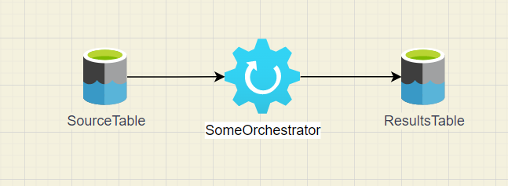

# Diagram Validation

```
$> spetlr-check-diagram --help
usage: spetlr-check-diagram [-h] --code-path CODE_PATH --diagram DIAGRAM [--start-tag START_TAG] [--stop-tag STOP_TAG] [--include-files INCLUDE_FILES]

Compare DrawIO digram edges to docstrings.

optional arguments:
  -h, --help            show this help message and exit
  --code-path CODE_PATH
                        Root of the codebase to parse.
  --diagram DIAGRAM     Path to the diagram to process.
  --start-tag START_TAG
                        Tag name for use in docstrings.
  --stop-tag STOP_TAG   Tag name for use in docstrings.
  --include-files INCLUDE_FILES
                        Regex to determine which files to read.
```

The assumed setup is that you have a python library, say `src/dataplatform`.  
Individual classes or files in the `dataplatform` library can then be marked up with 
docstrings as follows. 
```python
class SomeOrchestrator:
    """
    Some free text describing my orchestrator.
    ```diagram
    node:
        name: SomeOrchestrator
        incoming:
            - SourceTable
            - DetailsTable
        outgoing:
            - ResultsTable
    ```
    """
```

This tool works on all drawio file types. It scans the drawio diagram for arrows 
that connect any two entities that are connected with a line, registering a 
source to target connection for each line. The type of symbol, or style of line are 
irrelevant. Suppose you have a diagram as in the following example.



You can now run
```powershell
$> spetlr-check-diagram `
    --code-path src/dataplatform `
    --diagram docs/my-dataplatform-diagram.drawio
```

The tool will tell you that you are missing a connection from DetailsTable to 
SomeOrchestrator and will return an error code. If you add such an arrow and rerun 
the tool, the command will return without exit code.

## Reference

### Supported file types
Currently only drawio (aka diagram.net) is supported. Supported file types are
- `.drawio` compressed and uncompressed
- `.xml`
- editable `.png`
- editable `.svg`

Please note that you will need the python library `pillow` if you want to work with 
`png` files. It is a heavy dependency and not included by default. You can install 
it by running
```
pip install pillow
```

### Syntax for markup
All files in the given directory are searched for occurrences of the start and stop 
tags. Lines between the tags must be valid YAML. In python files, it is expected 
that the best place to put the lines is in docstrings.

The default start tag is 
```` 
```diagram 
````
(three leading backticks.)
the default stop tag is 
````
```
````
(just three backticks).
Both can be changed on the command line.

By default, only file names that match the inclusion regex `.py$` are searched. The 
inclusion regex can be changed on the command line.

### YAML node syntax

All yaml markup should adhere to this pattern
````
```diagram  # default start tag

a_node_alias:
    name: Label on node in diagram

my_orchestrator:
    name: Label on orchestrator in diagram
    incoming:  # section is optional
        - "literal label on an expected node"
        - another
    outgoing:  # section is optional
        - a_node_alias  # marking an incoming connection on a_node_alias is eqiovalent

```  # default end tag
````

Here `a_node_alias` allows for a longer label while keeping short entries in the 
incoming/outgoing lists.

All yaml markup from the entire codebase is collected together before the edge 
connections are extracted. All node keys should therefore be unique. If a node key 
is reused with a different configuration, a meaningful error is generated.

### Notes on diagram usage
In the diagram, the tool looks for directional edges between nodes, and labels them 
by the label of the source and target node. To allow this, the arrow must connect to 
the graphics entities (dragging the node around lets the arrow follow). If the arrow 
does not update when the node moves, then it will not work.

Any details of the node icon or arrow style are irrelevant. Intermediate waypoints 
of the arrows are irrelevant. If you want bidirectional connections, you need two 
arrows, since the arrow styles are not used.

The tool only looks for connections between named nodes. Having multiple nodes with 
the same name is fine. You can have multiple icons for the same table if this makes 
your diagram cleaner.