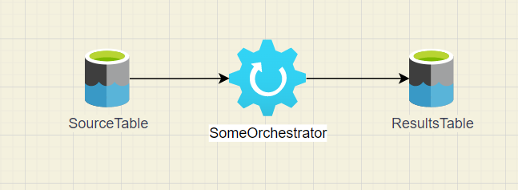

# Diagram Validation

```
$> spetlr-check-diagram                                                      
usage: spetlr-check-diagram [-h] [--tag TAG] module diagram
spetlr-check-diagram: error: the following arguments are required: module, diagram
```

The assumed setup is that you have a python library, say `dataplatform`, that is 
importable in the local virtual environment. Individual classes in the 
`dataplatform` library can then be marked up with docstrings as follows.
Example `src/dataplatform/my/folder/SomeOrchestrator.py`:
```python
class SomeOrchestrator:
    """
    Some free text describing my orchestrator.
    ```spetlr diagram
    node:
        name: SomeOrchestrator
        incoming:
            - SourceTable
            - DetailsTable
        outgoing:
            - ResultsTable
    ```
    """
```

This tool works only on drawio diagrams for now. It scans the drawio diagram for 
arrows that connect any two entities that are connected with a line, registering a 
source to target connection for each line. The type of symbol, or style of line are 
irrelevant. Suppose you have a diagram as in the following example.



You can now run
```powershell
$> spetlr-check-diagram dataplatform docs/my-dataplatform-diagram.drawio
```

The tool will tell you that you are missing a connection from DetailsTable to 
SomeOrchestrator and will return an error code. If you add such an arrow and rerun 
the tool, the command will return without exit code.

